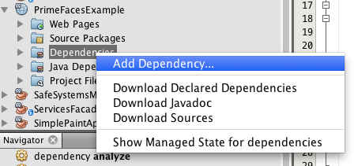

### Escuela Colombiana de Ingeniería

### Procesos de desarrollo de Software – PDSW

#### Frameworks Web MVC – Java Server Faces / Prime Faces

En este ejercicio, usted va a desarrollar una aplicación Web basada en
el marco JSF, y en una de sus implementaciones más usadas: [PrimeFaces]([*http://primefaces.org/*](http://primefaces.org/) ). Se trata de un
juego en línea para adivinar un número, en el que el ganador, si atina
en la primera oportunidad, recibe \$100.000. Luego, por cada intento
fallido, el premio se reduce en \$10.000.

1.  Desde NetBeans, construya un proyecto Maven, usando el arquetipo de
    aplicación Web estándar:

	

1.  Al proyecto Maven, debe agregarle las dependencias de JavaEE, JSF y
    Primefaces (en el archivo pom.xml). Para hacer esto de forma
    asistida, seleccione la opción de agregar dependencias:

    

    La cual le permitirá ingresar, de las dependencias requeridas: ID
    del grupo, ID del artefacto, y versión:

    

    Con lo anterior, haga que queden las siguientes dependencias en el
    pom.xml:

	

1.  Para que NetBeans configure automáticamente el descriptor de
    despliegue de la aplicación (archivo web.xml), de manera que el
    *framework* JSF se active al inicio de la aplicación, en las
    propiedades del proyecto seleccione ‘Frameworks’, y luego la opción
    de agregar uno nuevo:

	

	Seleccione el framework JSF:

	

	Y seleccione, para dicho *framework*, la implementación de PrimeFaces:

	

1.  Revise cómo lo anterior modificó el archivo web.xml de
    la aplicación.

2.  Ahora, va a crear un ‘Backing-Bean’ de sesión, el cual, para cada
    usuario, mantendrá de lado del servidor las siguientes propiedades
    (es decir, los respectivos métodos get/set):

    a.  El número que actualmente debe adivinar.

    b.  El número de intentos realizados.

    c.  El premio acumulado hasta el momento.

    d.  El estado del juego, que sería una cadena de texto que indica si
        ya ganó o no, y si ganó de cuanto es el premio.

	Para hacer esto, cree una clase que tenga las anotaciones:

	@ManagedBean, incluyendo el nombre: @ManagedBean(name = 	"beanEstadoAdivinanza") y @SessionScoped, de manera que se cree una instancia de dicho Backing-Bean para cada sesión (es decir para cada navegador Web conectado).

	A la implementación de esta clase, agregue un método llamado ‘reiniciar’, el cual sirva para volver a iniciar el juego (inicializar de nuevo el número a adivinar, y restaurar el premio a su valor original).

1.  Cree una página XHTML, de nombre ‘adivina.xhtml’ (debe quedar en la ruta ‘Web Pages’).

	

1.  Revise en la [página 13 del manual de PrimeFaces](http://www.primefaces.org/docs/guide/primefaces_user_guide_5_2.pdf), qué espacios de nombres XML requiere una página de PrimeFaces, y
    cual es la estructura básica de la misma. A partir de esto, cree la
    siguiente página, con un formulario llamado
    ‘formulario_adivinanza’:

	

1.  Al formulario, agregue:

    a.  Un elemento de tipo \<p:inputText\> para que el usuario
        ingrese su número.

    b.  Un elemento de tipo \<p:outputLabel\> para mostrar el número
        de intentos realizados.

    c.  Un elemento de tipo \<p:outputLabel\> para mostrar el estado
        del juego.

    d.  Un elemento de tipo \<p:outputLabel\> para mostrar en cuanto
        va el premio.

	Y asocie dichos elementos al BackingBean de sesión a través de su propiedad ‘value’, y usando como referencia el nombre asignado:

	```xml
	value="#{beanEstadoAdivinanza.nombrePropiedad}"
	```
	
1.  Al formulario, agregue dos botones de tipo \<p:commandButton\>,
    uno para enviar el número ingresado y ver si se ‘atinó’, y otro para
    reiniciar el juego.

    a.  El botón de ‘envío de adivinanza’ debe tener asociado a su
        propiedad “update” el nombre del formulario en el que se
        agregaron los campos antes descritos, de manera que al hacer
        clic, se ejecute un ciclo de JSF y se ‘refresque’ la vista:

        <p:commandButton update="formulario_adivinanza">…

    b.  El botón de reiniciar juego tendrá la misma propiedad de
        ‘update’ del otro botón, más la propiedad ‘actionListener’, con la cual se le indicará que, al hacer clic, se ejecutará el
        método ‘reiniciar’, creado en el backing-bean de sesión:

	```xml
        <p:commandButton update="…" actionListener="#{beanEstadoAdivinanza.reiniciar}">
	```

2.  Para verificar el funcionamiento de la aplicación, agregue el plugin
    tomcat-runner dentro de los plugins de la fase de
    construcción (build). Tenga en cuenta que en la configuración del
    plugin se indica bajo que ruta quedará la aplicación:

	```xml
            <plugin>
                <groupId>org.apache.tomcat.maven</groupId>
                <artifactId>tomcat7-maven-plugin</artifactId>
                <version>2.2</version>
                <configuration>                    
                    <path>/</path>
                </configuration>
            </plugin>            

	```


3.  Una vez hecho esto, desde la terminal, en el directorio del
    proyecot, ejecute:

    a.  mvn package

    b.  mvn tomcat7:run

	Si no hay errores, la aplicación debería quedar accesible en la URL: http://localhost:8080/faces/adivina.xhtml

4.  Si todo funcionó correctamente, realice la siguiente prueba:

    a.  Abra la aplicación en dos computadores diferentes. Si no dispone
        de uno, hágalo en dos navegadores diferentes (por ejemplo Chrome
        y Firefox). Haga cinco intentos en uno, y luego un intento en
        el otro. El valor del premio coincide?

    b.  Aborte el proceso de Tomcat-runner haciendo Ctrl+C en la consola,
        y modifique el código del backing-bean de manera que use la
        anotación @ApplicationScoped en lugar de @SessionScoped.
        Reinicie la aplicación y repita el ejercicio anterior. Coinciden
        los valores del premio?. Dado la anterior, cual es la diferencia
        entre los backing-beans de sesión y los de aplicación?

### Parte II


Ahora, va a realizar una aplicación (capa de presentación y control Web) que permita manejar los pedidos de un restaurante y el cálculo de las cuentas de los mismos, a partir del modelo realizado en uno de los ejercicios anteriores (basado en Google Guice), donde se desarrolló una 'capa' de servicios:


Para esto, clone el proyecto de ESTE respositorio, el cual ya tiene la configuración para usar JSF/Primefaces (tenga en cuenta que, además de copiar en éste los fuentes del ejercicio anterior, tendrá que agregar las mismas depedencias Maven).

1. La página debe mostrar una tabla donde se muestre:
    - Número de la orden.
    - Número de ítems asociado a la orden.

2. Debe tener un botón que permita crear una nueva orden vacía. Al seleccionar esta opción, se debería ver reflejada la nueva orden en la tabla anterior, con 0 ítems.

3. Se debe poder seleccionar una de las ordenes. Al hacer esto, en otra parte de la interfaz se debe:
    - Mostrar el detalle de los ítems asociados a la orden.
    - Mostrar el valor actual total de la orden.
    - Ofrecer una opción para agregar un nuevo ítem a la cuenta. Por ahora el modelo no contempla un catálogo de platos (ya que no hay una capa de persistencia), por lo que se deben ingresar los detalles cada vez: tipo de producto (bebida, plato), nombre y precio. Al agregar cada ítem, se debería recalcular y mostrar automáticamente el nuevo valor de la cuenta.
    
Para lo anterior revise:

Sección 3.33 del manual de PrimeFaces, en especial la página 159 que se
refiere a cómo capturar la selección de una tabla.
[*http://www.primefaces.org/docs/guide/primefaces\_user\_guide\_5\_2.pdf*](http://www.primefaces.org/docs/guide/primefaces_user_guide_5_2.pdf)

Para que la tabla del listado de productos, y la tabla correspondiente
al carrito de compras queden distribuidos de una forma organizada (y no
uno debajo del otro), revise el uso de éste en la sección 3.64 del mismo
manual, o a través de las demostraciones disponibles en:

[*http://www.primefaces.org/showcase/ui/panel/layout/element.xhtml*](http://www.primefaces.org/showcase/ui/panel/layout/element.xhtml)


Para el ejercicio anterior tenga también en cuenta:

- para la organización de las clases, use el esquema de paquetes del diagrama anterior.
- La aplicación debería cambiar de comportamiento cuando se cambie la configuración del Contenedor Guice.
- El esquema de pruebas desarrollado debería seguir funcionando.